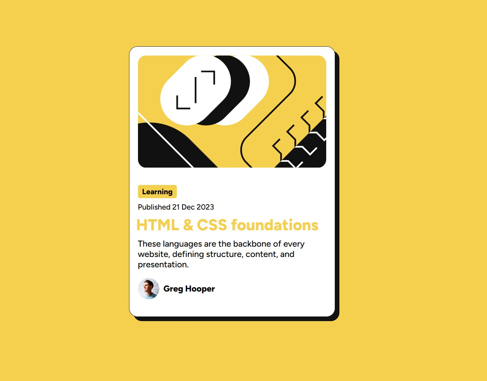

# Frontend Mentor - Blog preview card solution

This is a solution to the [Blog preview card challenge on Frontend Mentor](https://www.frontendmentor.io/challenges/blog-preview-card-ckPaj01IcS). Frontend Mentor challenges help you improve your coding skills by building realistic projects. 

## Table of contents

- [Overview](#overview)
  - [The challenge](#the-challenge)
  - [Screenshot](#screenshot)
  - [Links](#links)
- [My process](#my-process)
  - [Built with](#built-with)
  - [What I learned](#what-i-learned)
- [Author](#author)

## Overview

### The challenge

Users should be able to:

- See hover and focus states for all interactive elements on the page

### Screenshot

### Links

- Solution URL: https://github.com/adptCode/blog-preview-card-main.git
- Live Site URL: https://blog-preview-adpt.netlify.app/

## My process

### Built with

- CSS custom properties
- Flexbox
- CSS Grid
- Mobile-first workflow

### What I learned

In this project, I improved my skills in creating responsive and interactive designs. Here’s what I learned:

- CSS Grid: Centered content effortlessly using display: grid and place-items: center.
- Responsive Typography: Used rem, em, and clamp() to create scalable font sizes without media queries.
- Variable Fonts: Implemented flexible typography with fewer files using @font-face.
- Interactivity: Enhanced user experience with smooth hover and focus states using transitions.
- Design Depth: Added shadows and clean padding for a polished, professional look.
- Real-World Application: Gained hands-on experience with modern CSS techniques for reusable UI components.

This project helped me refine practical, responsive design skills applicable to real-world projects.

## Author

- Website - https://github.com/adptCode
- Frontend Mentor - https://www.frontendmentor.io/profile/adptCode
- Twitter - https://x.com/AlessandroDPT
